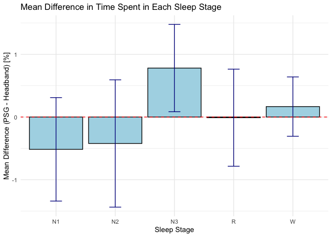
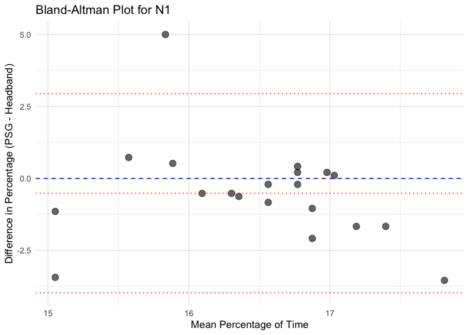
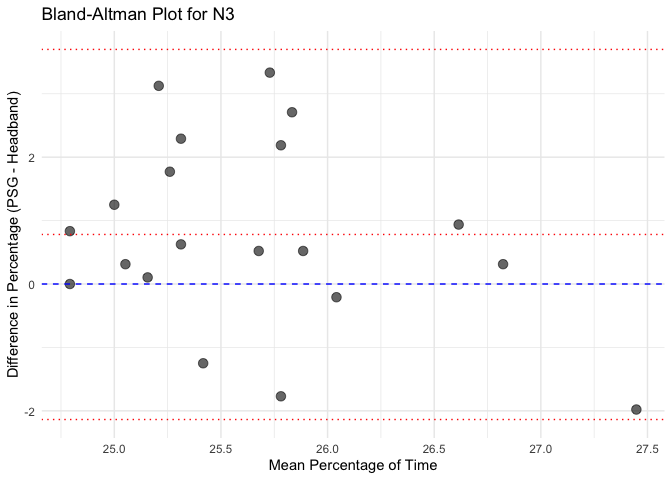
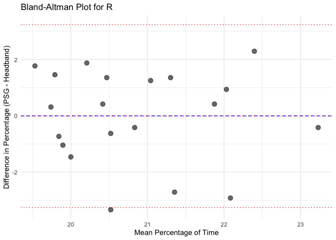
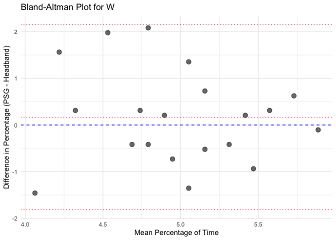
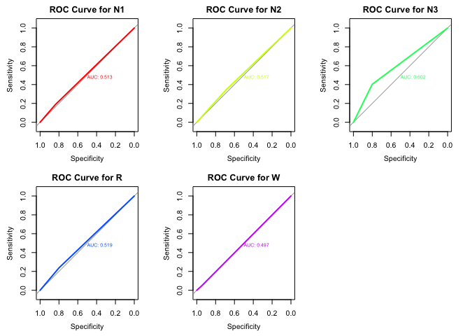

---
author:
- Mario Miguel
authors:
- name: Mario Miguel
  orcid: 0000-0002-7248-3529
categories:
- Sleep
- PSD
date: 2025-03-11
description: This post presents an analysis of sleep stage
  classification validation using polysomnography (PSG) as the ground
  truth and a headband-based device as the test instrument. The workflow
  includes generating synthetic sleep data, loading real-world datasets,
  and comparing sleep stage distributions between the two devices. The
  validation process includes Bland-Altman analysis, Pearson
  correlation, Cohen's Kappa, and statistical measures of agreement. The
  results provide insight into the accuracy and bias of wearable
  sleep-tracking devices in sleep stage classification.
execute.freeze: true
header-includes:
- |
  <script src="../../site_libs/kePrint-0.0.1/kePrint.js"></script>
  <link href="../../site_libs/lightable-0.0.1/lightable.css" rel="stylesheet" />
image: cover.jpg
title: Sleep PSG validation
toc-title: Table of contents
---

<script src="../../site_libs/kePrint-0.0.1/kePrint.js"></script>
<link href="../../site_libs/lightable-0.0.1/lightable.css" rel="stylesheet" />

#### Load necessary libraries

::: cell
``` {.r .cell-code}
library(dplyr)
library(ggplot2)
library(knitr)
library(irr) 
library(caret)
library(pROC)
library(blandr)
library(kableExtra)
library(knitr)
```
:::

#### Add seeds for reproductibility - used when generating synthetic data only

::: cell
``` {.r .cell-code}
set.seed(2)  # For the PSG dataset
set.seed(1)  # For the Headband dataset
```
:::

#### Define parameters (need to run this code before generating synthetic data and before opening real data, because of sleep_stages)

::: cell
``` {.r .cell-code}
num_subjects <- 20
epochs_per_night <- 8 * 60 * 2 # 8 hours, 30 seconds per epoch 
sleep_stages <- c("W", "N1", "N2", "N3", "R")
```
:::

#### Generate synthetic data - PSG ground truth

<div>

> **Warning!**
>
> Do not run this if you are using real data.
>
> **Note:** Instead of using the synthetic data, you can use the real
> data from the ground truth device and the device you want to validate.
> To do so, you can load the data using the `read.csv()` function and
> then proceed with the analysis. Please mind the structure of the data
> and adjust the code accordingly (Subject ID, Epoch, Time, Sleep
> Stage).

</div>

::: cell
``` {.r .cell-code}
generate_sleep_data_with_cycles <- function(subject_id, total_epochs, cycles) {
  # Define time variables
  epoch_duration <- 30  # seconds
  cycle_duration <- 90 * 60 / epoch_duration  # Approximate 90-minute cycle in epochs
  
  # Define stage probabilities per cycle
  cycle_probs <- list(
    c(W = 0.05, N1 = 0.1, N2 = 0.2, N3 = 0.55, R = 0.1),  # Cycle 1: more N3
    c(W = 0.05, N1 = 0.1, N2 = 0.3, N3 = 0.45, R = 0.1),  # Cycle 2: slightly more N2
    c(W = 0.05, N1 = 0.15, N2 = 0.4, N3 = 0.2, R = 0.2),  # Cycle 3: less N3, more REM
    c(W = 0.05, N1 = 0.2, N2 = 0.35, N3 = 0.1, R = 0.3),  # Cycle 4: mostly REM
    c(W = 0.05, N1 = 0.25, N2 = 0.35, N3 = 0.05, R = 0.3)  # Cycle 5: mainly REM with N2
  )

  # Initialize data frame for each subject
  sleep_data <- data.frame(
    Subject_ID = integer(0), Epoch = integer(0),
    Time = as.POSIXct(character(0)), Sleep_Stage = character(0)
  )

  # Generate epochs for each cycle with specified probabilities
  for (cycle in 1:cycles) {
    # Define epochs for current cycle
    cycle_epochs <- ifelse(cycle < cycles, cycle_duration, total_epochs - nrow(sleep_data))
    
    # Generate data for this cycle
    cycle_data <- data.frame(
      Subject_ID = subject_id,
      Epoch = (nrow(sleep_data) + 1):(nrow(sleep_data) + cycle_epochs),
      Time = seq.POSIXt(
        from = as.POSIXct("2024-01-01 22:00:00") + ((cycle - 1) * 90 * 60),
        by = "30 secs",
        length.out = cycle_epochs
      ),
      Sleep_Stage = sample(names(cycle_probs[[cycle]]), cycle_epochs, replace = TRUE, prob = cycle_probs[[cycle]])
    )
    
    # Append to overall data
    sleep_data <- rbind(sleep_data, cycle_data)
  }
  
  return(sleep_data)
}

# Generate PSG dataset with cycles for each subject
num_cycles <- 5  # Approximate number of cycles per night
PSG <- do.call(rbind, lapply(1:num_subjects, generate_sleep_data_with_cycles, total_epochs = epochs_per_night, cycles = num_cycles))

# Save the dataset as a CSV file
#write.csv(PSG, "PSG_data.csv", row.names = FALSE)
```
:::

#### Generate synthetic data - Headband

<div>

> **Warning!**
>
> Do not run this if you are using real data.

</div>

::: cell
``` {.r .cell-code}
generate_sleep_data_with_cycles <- function(subject_id, total_epochs, cycles) {
  # Define time variables
  epoch_duration <- 30  # seconds
  cycle_duration <- 90 * 60 / epoch_duration  # Approximate 90-minute cycle in epochs
  
  # Define stage probabilities per cycle
  cycle_probs <- list(
    c(W = 0.05, N1 = 0.1, N2 = 0.2, N3 = 0.55, R = 0.1),  # Cycle 1: more N3
    c(W = 0.05, N1 = 0.1, N2 = 0.3, N3 = 0.45, R = 0.1),  # Cycle 2: slightly more N2
    c(W = 0.05, N1 = 0.15, N2 = 0.4, N3 = 0.2, R = 0.2),  # Cycle 3: less N3, more REM
    c(W = 0.05, N1 = 0.2, N2 = 0.35, N3 = 0.1, R = 0.3),  # Cycle 4: mostly REM
    c(W = 0.05, N1 = 0.25, N2 = 0.35, N3 = 0.05, R = 0.3)  # Cycle 5: mainly REM with N2
  )

  # Initialize data frame for each subject
  sleep_data <- data.frame(
    Subject_ID = integer(0), Epoch = integer(0),
    Time = as.POSIXct(character(0)), Sleep_Stage = character(0)
  )

  # Generate epochs for each cycle with specified probabilities
  for (cycle in 1:cycles) {
    # Define epochs for current cycle
    cycle_epochs <- ifelse(cycle < cycles, cycle_duration, total_epochs - nrow(sleep_data))
    
    # Generate data for this cycle
    cycle_data <- data.frame(
      Subject_ID = subject_id,
      Epoch = (nrow(sleep_data) + 1):(nrow(sleep_data) + cycle_epochs),
      Time = seq.POSIXt(
        from = as.POSIXct("2024-01-01 22:00:00") + ((cycle - 1) * 90 * 60),
        by = "30 secs",
        length.out = cycle_epochs
      ),
      Sleep_Stage = sample(names(cycle_probs[[cycle]]), cycle_epochs, replace = TRUE, prob = cycle_probs[[cycle]])
    )
    
    # Append to overall data
    sleep_data <- rbind(sleep_data, cycle_data)
  }
  
  return(sleep_data)
}

# Generate PSG dataset with cycles for each subject
num_cycles <- 5  # Approximate number of cycles per night
Headband <- do.call(rbind, lapply(1:num_subjects, generate_sleep_data_with_cycles, total_epochs = epochs_per_night, cycles = num_cycles))

# Save the dataset as a CSV file
#write.csv(Headband, "Headband.csv", row.names = FALSE)
```
:::

#### Calculate the percentage of time spent in each sleep stage

::: cell
``` {.r .cell-code}
# Calculate the percentage of time spent in each sleep stage for the PSG dataset
PSG_percentage <- PSG %>%
  group_by(Subject_ID, Sleep_Stage) %>%
  summarise(Epoch_Count = n(), .groups = 'drop') %>%
  mutate(Percentage = (Epoch_Count / (8 * 60 * 2)) * 100)  # Total epochs = 8 hours * 60 mins * 2 (30 sec epochs)

# Calculate the percentage of time spent in each sleep stage for the Headband dataset
Headband_percentage <- Headband %>%
  group_by(Subject_ID, Sleep_Stage) %>%
  summarise(Epoch_Count = n(), .groups = 'drop') %>%
  mutate(Percentage = (Epoch_Count / (8 * 60 * 2)) * 100)  # Total epochs = 8 hours * 60 mins * 2 (30 sec epochs)

# Merge the percentages for both datasets
merged_data <- full_join(PSG_percentage, Headband_percentage, 
                         by = c("Subject_ID", "Sleep_Stage"), 
                         suffix = c("_PSG", "_Headband"))
```
:::

#### Plot the percentage of time spent in each sleep stage for PSG and Headband

:::: cell
``` {.r .cell-code}
difference_data <- merged_data %>%
  mutate(Difference = (Percentage_PSG - Percentage_Headband)) %>%
  group_by(Sleep_Stage) %>%
  summarise(Average_Difference = mean(Difference, na.rm = TRUE), .groups = 'drop')

# Plot the differences for each sleep stage
ggplot(difference_data, aes(x = Sleep_Stage, y = Average_Difference, fill = Sleep_Stage)) +
  geom_bar(stat = "identity", position = position_dodge(width = 0.8), width = 0.7) +
  labs(title = "Difference in Time Spent per Sleep Stage between PSG and Headband",
       x = "Sleep Stage",
       y = "Average Difference in Percentage (%)") +
  scale_fill_brewer(palette = "Set3") +
  theme_minimal() +
  theme(legend.position = "none")
```

::: cell-output-display

:::
::::

#### Calculate mean differences and confidence intervals for each sleep stage - Bias

:::: cell
``` {.r .cell-code}
# Calculate mean differences and confidence intervals for each sleep stage
mean_diff_results <- merged_data %>%
  group_by(Sleep_Stage) %>%
  summarise(
    Mean_Difference = mean(Percentage_PSG - Percentage_Headband, na.rm = TRUE),
    SD_Difference = sd(Percentage_PSG - Percentage_Headband, na.rm = TRUE),
    Count = n(),
    SE_Difference = SD_Difference / sqrt(Count),
    CI_Lower = Mean_Difference - qt(0.975, Count - 1) * SE_Difference,  # 95% CI
    CI_Upper = Mean_Difference + qt(0.975, Count - 1) * SE_Difference,
    .groups = 'drop'
  )
# Plot the mean difference with error bars
library(ggplot2)

ggplot(mean_diff_results, aes(x = Sleep_Stage, y = Mean_Difference)) +
  geom_bar(stat = "identity", fill = "lightblue", color = "black") +
  geom_errorbar(aes(ymin = CI_Lower, ymax = CI_Upper), width = 0.2, color = "darkblue") +
  geom_hline(yintercept = 0, linetype = "dashed", color = "red") +  # Line at zero for reference
  labs(title = "Mean Difference in Time Spent in Each Sleep Stage",
       x = "Sleep Stage",
       y = "Mean Difference (PSG - Headband) [%]") +
  theme_minimal()
```

::: cell-output-display

:::
::::

#### Bland-Altman Statistics

:::: cell
``` {.r .cell-code}
# List of unique sleep stages
sleep_stages <- unique(merged_data$Sleep_Stage)

# Initialize an empty list to store results
ba_results <- list()

# Loop through each sleep stage and calculate Bland-Altman statistics
for (stage in sleep_stages) {
  stage_data <- merged_data %>% filter(Sleep_Stage == stage)
  ba_stats <- blandr.statistics(stage_data$Percentage_PSG, stage_data$Percentage_Headband)
  
  # Append the Bland-Altman statistics object to the list with the stage name
  ba_results[[stage]] <- ba_stats
}

# Print the results for each sleep stage
for (stage in names(ba_results)) {
  cat("\n\nResults for Sleep Stage:", stage, "\n")
  print(ba_results[[stage]])
}
```

::: {.cell-output .cell-output-stdout}


    Results for Sleep Stage: N1 
    Bland-Altman Statistics
    =======================
    t = -1.3072, df = 19, p-value = 0.2067
    alternative hypothesis: true bias is not equal to 0

    =======================
    Number of comparisons:  20 
    Maximum value for average measures:  17.8125 
    Minimum value for average measures:  15.05208 
    Maximum value for difference in measures:  5 
    Minimum value for difference in measures:  -3.541667 

    Bias:  -0.515625 
    Standard deviation of bias:  1.76404 

    Standard error of bias:  0.3944513 
    Standard error for limits of agreement:  0.6856898 

    Bias:  -0.515625 
    Bias- upper 95% CI:  0.309971 
    Bias- lower 95% CI:  -1.341221 

    Upper limit of agreement:  2.941893 
    Upper LOA- upper 95% CI:  4.377058 
    Upper LOA- lower 95% CI:  1.506728 

    Lower limit of agreement:  -3.973143 
    Lower LOA- upper 95% CI:  -2.537978 
    Lower LOA- lower 95% CI:  -5.408308 

    =======================
    Derived measures:  
    Mean of differences/means:  -3.040415 
    Point estimate of bias as proportion of lowest average:  -3.425606 
    Point estimate of bias as proportion of highest average -2.894737 
    Spread of data between lower and upper LoAs:  6.915036 
    Bias as proportion of LoA spread:  -7.456577 

    =======================
    Bias: 
     -0.515625  ( -1.341221  to  0.309971 ) 
    ULoA: 
     2.941893  ( 1.506728  to  4.377058 ) 
    LLoA: 
     -3.973143  ( -5.408308  to  -2.537978 ) 


    Results for Sleep Stage: N2 
    Bland-Altman Statistics
    =======================
    t = -0.86936, df = 19, p-value = 0.3955
    alternative hypothesis: true bias is not equal to 0

    =======================
    Number of comparisons:  20 
    Maximum value for average measures:  33.85417 
    Minimum value for average measures:  29.89583 
    Maximum value for difference in measures:  4.895833 
    Minimum value for difference in measures:  -4.583333 

    Bias:  -0.421875 
    Standard deviation of bias:  2.170194 

    Standard error of bias:  0.4852702 
    Standard error for limits of agreement:  0.8435639 

    Bias:  -0.421875 
    Bias- upper 95% CI:  0.5938073 
    Bias- lower 95% CI:  -1.437557 

    Upper limit of agreement:  3.831706 
    Upper LOA- upper 95% CI:  5.597306 
    Upper LOA- lower 95% CI:  2.066107 

    Lower limit of agreement:  -4.675456 
    Lower LOA- upper 95% CI:  -2.909857 
    Lower LOA- lower 95% CI:  -6.441056 

    =======================
    Derived measures:  
    Mean of differences/means:  -1.323016 
    Point estimate of bias as proportion of lowest average:  -1.41115 
    Point estimate of bias as proportion of highest average -1.246154 
    Spread of data between lower and upper LoAs:  8.507162 
    Bias as proportion of LoA spread:  -4.959057 

    =======================
    Bias: 
     -0.421875  ( -1.437557  to  0.5938073 ) 
    ULoA: 
     3.831706  ( 2.066107  to  5.597306 ) 
    LLoA: 
     -4.675456  ( -6.441056  to  -2.909857 ) 


    Results for Sleep Stage: N3 
    Bland-Altman Statistics
    =======================
    t = 2.3468, df = 19, p-value = 0.02993
    alternative hypothesis: true bias is not equal to 0

    =======================
    Number of comparisons:  20 
    Maximum value for average measures:  27.44792 
    Minimum value for average measures:  24.79167 
    Maximum value for difference in measures:  3.333333 
    Minimum value for difference in measures:  -1.979167 

    Bias:  0.78125 
    Standard deviation of bias:  1.488757 

    Standard error of bias:  0.3328962 
    Standard error for limits of agreement:  0.5786862 

    Bias:  0.78125 
    Bias- upper 95% CI:  1.47801 
    Bias- lower 95% CI:  0.08449032 

    Upper limit of agreement:  3.699214 
    Upper LOA- upper 95% CI:  4.910418 
    Upper LOA- lower 95% CI:  2.488009 

    Lower limit of agreement:  -2.136714 
    Lower LOA- upper 95% CI:  -0.9255094 
    Lower LOA- lower 95% CI:  -3.347918 

    =======================
    Derived measures:  
    Mean of differences/means:  3.090366 
    Point estimate of bias as proportion of lowest average:  3.151261 
    Point estimate of bias as proportion of highest average 2.8463 
    Spread of data between lower and upper LoAs:  5.835927 
    Bias as proportion of LoA spread:  13.3869 

    =======================
    Bias: 
     0.78125  ( 0.08449032  to  1.47801 ) 
    ULoA: 
     3.699214  ( 2.488009  to  4.910418 ) 
    LLoA: 
     -2.136714  ( -3.347918  to  -0.9255094 ) 


    Results for Sleep Stage: R 
    Bland-Altman Statistics
    =======================
    t = -0.028155, df = 19, p-value = 0.9778
    alternative hypothesis: true bias is not equal to 0

    =======================
    Number of comparisons:  20 
    Maximum value for average measures:  23.22917 
    Minimum value for average measures:  19.53125 
    Maximum value for difference in measures:  2.291667 
    Minimum value for difference in measures:  -3.333333 

    Bias:  -0.01041667 
    Standard deviation of bias:  1.654596 

    Standard error of bias:  0.3699789 
    Standard error for limits of agreement:  0.6431485 

    Bias:  -0.01041667 
    Bias- upper 95% CI:  0.763958 
    Bias- lower 95% CI:  -0.7847913 

    Upper limit of agreement:  3.232591 
    Upper LOA- upper 95% CI:  4.578716 
    Upper LOA- lower 95% CI:  1.886466 

    Lower limit of agreement:  -3.253424 
    Lower LOA- upper 95% CI:  -1.907299 
    Lower LOA- lower 95% CI:  -4.59955 

    =======================
    Derived measures:  
    Mean of differences/means:  -0.0266 
    Point estimate of bias as proportion of lowest average:  -0.05333333 
    Point estimate of bias as proportion of highest average -0.04484305 
    Spread of data between lower and upper LoAs:  6.486016 
    Bias as proportion of LoA spread:  -0.1606019 

    =======================
    Bias: 
     -0.01041667  ( -0.7847913  to  0.763958 ) 
    ULoA: 
     3.232591  ( 1.886466  to  4.578716 ) 
    LLoA: 
     -3.253424  ( -4.59955  to  -1.907299 ) 


    Results for Sleep Stage: W 
    Bland-Altman Statistics
    =======================
    t = 0.73662, df = 19, p-value = 0.4703
    alternative hypothesis: true bias is not equal to 0

    =======================
    Number of comparisons:  20 
    Maximum value for average measures:  5.885417 
    Minimum value for average measures:  4.0625 
    Maximum value for difference in measures:  2.083333 
    Minimum value for difference in measures:  -1.458333 

    Bias:  0.1666667 
    Standard deviation of bias:  1.011854 

    Standard error of bias:  0.2262575 
    Standard error for limits of agreement:  0.393312 

    Bias:  0.1666667 
    Bias- upper 95% CI:  0.640229 
    Bias- lower 95% CI:  -0.3068956 

    Upper limit of agreement:  2.149901 
    Upper LOA- upper 95% CI:  2.973112 
    Upper LOA- lower 95% CI:  1.326689 

    Lower limit of agreement:  -1.816567 
    Lower LOA- upper 95% CI:  -0.9933558 
    Lower LOA- lower 95% CI:  -2.639779 

    =======================
    Derived measures:  
    Mean of differences/means:  3.584975 
    Point estimate of bias as proportion of lowest average:  4.102564 
    Point estimate of bias as proportion of highest average 2.831858 
    Spread of data between lower and upper LoAs:  3.966468 
    Bias as proportion of LoA spread:  4.201891 

    =======================
    Bias: 
     0.1666667  ( -0.3068956  to  0.640229 ) 
    ULoA: 
     2.149901  ( 1.326689  to  2.973112 ) 
    LLoA: 
     -1.816567  ( -2.639779  to  -0.9933558 ) 
:::
::::

:::::::::::::: cell
``` {.r .cell-code}
# List of unique sleep stages
sleep_stages <- unique(merged_data$Sleep_Stage)

# Initialize an empty list to store results
ba_results <- list()

# Loop through each sleep stage and calculate Bland-Altman statistics
for (stage in sleep_stages) {
  stage_data <- merged_data %>% filter(Sleep_Stage == stage)
  
  # Calculate Bland-Altman statistics
  ba_stats <- blandr.statistics(stage_data$Percentage_PSG, stage_data$Percentage_Headband)
  
  # Append the Bland-Altman statistics object to the list with the stage name
  ba_results[[stage]] <- ba_stats
  
  # Generate the Bland-Altman plot using blandr.draw
  plot_title <- paste('Bland-Altman plot for', stage)  # Concatenate the plot title properly
  ba_plot <- blandr.draw(stage_data$Percentage_PSG, stage_data$Percentage_Headband, 
                         plotTitle = plot_title, ciDisplay = TRUE, ciShading = TRUE)
  
  # Print each plot
  print(ba_plot)
}
```

::: {.cell-output .cell-output-stderr}
    Warning: Use of `plot.data$x.axis` is discouraged.
    ℹ Use `x.axis` instead.
:::

::: {.cell-output .cell-output-stderr}
    Warning: Use of `plot.data$y.axis` is discouraged.
    ℹ Use `y.axis` instead.
:::

::: cell-output-display

:::

::: {.cell-output .cell-output-stderr}
    Warning: Use of `plot.data$x.axis` is discouraged.
    ℹ Use `x.axis` instead.
    Use of `plot.data$y.axis` is discouraged.
    ℹ Use `y.axis` instead.
:::

::: cell-output-display

:::

::: {.cell-output .cell-output-stderr}
    Warning: Use of `plot.data$x.axis` is discouraged.
    ℹ Use `x.axis` instead.
    Use of `plot.data$y.axis` is discouraged.
    ℹ Use `y.axis` instead.
:::

::: cell-output-display

:::

::: {.cell-output .cell-output-stderr}
    Warning: Use of `plot.data$x.axis` is discouraged.
    ℹ Use `x.axis` instead.
    Use of `plot.data$y.axis` is discouraged.
    ℹ Use `y.axis` instead.
:::

::: cell-output-display

:::

::: {.cell-output .cell-output-stderr}
    Warning: Use of `plot.data$x.axis` is discouraged.
    ℹ Use `x.axis` instead.
    Use of `plot.data$y.axis` is discouraged.
    ℹ Use `y.axis` instead.
:::

::: cell-output-display

:::
::::::::::::::

#### Bland-Altman plots (basic plots, w/o the blandr package)

:::::::: cell
``` {.r .cell-code}
# Calculate mean and difference for each sleep stage
bland_altman_data <- merged_data %>%
  mutate(Mean = (Percentage_PSG + Percentage_Headband) / 2,
         Difference = Percentage_PSG - Percentage_Headband)

# Create separate Bland-Altman plots for each sleep stage
unique_stages <- unique(bland_altman_data$Sleep_Stage)

# Loop through each sleep stage and create a Bland-Altman plot
for(stage in unique_stages) {
  stage_data <- bland_altman_data %>% filter(Sleep_Stage == stage)
  
  p <- ggplot(stage_data, aes(x = Mean, y = Difference)) +
    geom_point(size = 3, alpha = 0.6) +
    geom_hline(yintercept = 0, linetype = "dashed", color = "blue") +
    geom_hline(aes(yintercept = mean(Difference)), linetype = "dotted", color = "red") +
    geom_hline(aes(yintercept = mean(Difference) + 1.96 * sd(Difference)), linetype = "dotted", color = "red") +
    geom_hline(aes(yintercept = mean(Difference) - 1.96 * sd(Difference)), linetype = "dotted", color = "red") +
    labs(title = paste("Bland-Altman Plot for", stage),
         x = "Mean Percentage of Time",
         y = "Difference in Percentage (PSG - Headband)") +
    theme_minimal()
  
  # Print each plot
  print(p)
}
```

::: cell-output-display

:::

::: cell-output-display

:::

::: cell-output-display

:::

::: cell-output-display

:::

::: cell-output-display

:::
::::::::

#### Calculate Pearson correlation for each sleep stage and each instrument

:::: cell
``` {.r .cell-code}
# Calculate Pearson correlation for each sleep stage
correlation_results <- merged_data %>%
  group_by(Sleep_Stage) %>%
  summarise(Pearson_Correlation = cor(Percentage_PSG, Percentage_Headband, use = "complete.obs"), .groups = 'drop')

# Display the correlation results
# Display the correlation results in a table with a caption and a light blue background
kable(correlation_results, caption = "Pearson Correlation for Each Sleep Stage", digits = 3) %>%
  kable_styling(bootstrap_options = c("striped", "hover")) %>%
  row_spec(0, background = "lightblue")
```

::: cell-output-display
  Sleep_Stage     Pearson_Correlation
  ------------- ---------------------
  N1                           -0.192
  N2                            0.023
  N3                           -0.085
  R                             0.217
  W                            -0.026

  : Pearson Correlation for Each Sleep Stage
:::
::::

#### Calculate Cohen's Kappa for each sleep stage

:::: cell
``` {.r .cell-code}
# Merge PSG and Headband data by Subject_ID and Epoch to align epochs
merged_epochs <- PSG %>%
  select(Subject_ID, Epoch, Sleep_Stage_PSG = Sleep_Stage) %>%
  inner_join(Headband %>% select(Subject_ID, Epoch, Sleep_Stage_Headband = Sleep_Stage),
             by = c("Subject_ID", "Epoch"))

# Calculate Cohen's Kappa for each sleep stage
kappa_results <- lapply(sleep_stages, function(stage) {
  stage_data <- merged_epochs %>%
    filter(Sleep_Stage_PSG == stage | Sleep_Stage_Headband == stage) %>%
    mutate(Sleep_Stage_PSG = ifelse(Sleep_Stage_PSG == stage, 1, 0),
           Sleep_Stage_Headband = ifelse(Sleep_Stage_Headband == stage, 1, 0))
  
  # Calculate Cohen's Kappa for the current stage
  kappa_value <- kappa2(stage_data[, c("Sleep_Stage_PSG", "Sleep_Stage_Headband")], 
                        weight = "unweighted")$value
  
  data.frame(Sleep_Stage = stage, Cohen_Kappa = kappa_value)
})

# Combine results into a single data frame
kappa_results <- do.call(rbind, kappa_results)

# Display the Cohen's Kappa results
kable(kappa_results, caption = "Cohen's Kappa for Each Sleep Stage", digits = 3) %>%
  kable_styling(bootstrap_options = c("striped", "hover")) %>%
  row_spec(0, background = "lightblue")
```

::: cell-output-display
  Sleep_Stage     Cohen_Kappa
  ------------- -------------
  N1                   -0.814
  N2                   -0.657
  N3                   -0.590
  R                    -0.762
  W                    -0.956

  : Cohen\'s Kappa for Each Sleep Stage
:::
::::

#### Calculate Intraclass Correlation Coefficient (ICC) for each sleep stage

:::: cell
``` {.r .cell-code}
# Calculate ICC for each sleep stage by using the percentage of time spent in each stage
icc_results <- lapply(sleep_stages, function(stage) {
  stage_data <- merged_data %>%
    filter(Sleep_Stage == stage) %>%
    select(Percentage_PSG, Percentage_Headband)
  
  # Calculate ICC (2,1) for absolute agreement
  icc_value <- icc(stage_data, model = "twoway", type = "agreement", unit = "single")$value
  
  data.frame(Sleep_Stage = stage, ICC = icc_value)
})

# Combine results into a single data frame
icc_results <- do.call(rbind, icc_results)

# Display the ICC results
kable(icc_results, caption = "Intraclass Correlation Coefficient (ICC) for Each Sleep Stage", digits = 3) %>%
  kable_styling(bootstrap_options = c("striped", "hover")) %>%
  row_spec(0, background = "lightblue")
```

::: cell-output-display
  Sleep_Stage        ICC
  ------------- --------
  N1              -0.180
  N2               0.023
  N3              -0.065
  R                0.226
  W               -0.026

  : Intraclass Correlation Coefficient (ICC) for Each Sleep Stage
:::
::::

#### Calculate Mean Absolute Percentage Error (MAPE) for each sleep stage

:::: cell
``` {.r .cell-code}
mape_results <- merged_data %>%
  mutate(APE = ((Percentage_PSG - Percentage_Headband) / Percentage_PSG) * 100) %>%
  group_by(Sleep_Stage) %>%
  summarise(MAPE = mean(APE, na.rm = TRUE), .groups = 'drop')

mape_results <- mape_results %>%
  mutate(MAPE = paste0(round(MAPE, 2), "%"))

kable(mape_results, caption = "Mean Absolute Percentage Error (MAPE) for Each Sleep Stage", digits = 3) %>%
  kable_styling(bootstrap_options = c("striped", "hover")) %>%
  row_spec(0, background = "lightblue")
```

::: cell-output-display
  Sleep_Stage   MAPE
  ------------- --------
  N1            -3.65%
  N2            -1.56%
  N3            2.89%
  R             -0.33%
  W             1.42%

  : Mean Absolute Percentage Error (MAPE) for Each Sleep Stage
:::
::::

#### Calculate Concordance Correlation Coefficient (CCC) for each sleep stage

:::::: cell
``` {.r .cell-code}
library(DescTools)
```

::: {.cell-output .cell-output-stderr}

    Attaching package: 'DescTools'
:::

::: {.cell-output .cell-output-stderr}
    The following objects are masked from 'package:caret':

        MAE, RMSE
:::

``` {.r .cell-code}
# Calculate CCC for each sleep stage
ccc_results <- lapply(sleep_stages, function(stage) {
  stage_data <- merged_data %>%
    filter(Sleep_Stage == stage) %>%
    select(Percentage_PSG, Percentage_Headband)
  
  ccc_value <- CCC(stage_data$Percentage_PSG, stage_data$Percentage_Headband)$rho.c
  
  data.frame(Sleep_Stage = stage, CCC = ccc_value)
})

# Combine results into a single data frame
ccc_results <- do.call(rbind, ccc_results)

# Display the CCC results
kable(ccc_results, caption = "Concordance Correlation Coefficient (CCC) for Each Sleep Stage") %>%
  kable_styling(bootstrap_options = c("striped", "hover")) %>%
  row_spec(0, background = "lightblue")
```

::: cell-output-display
  Sleep_Stage        CCC.est   CCC.lwr.ci   CCC.upr.ci
  ------------- ------------ ------------ ------------
  N1              -0.1693247   -0.5219840    0.2327739
  N2               0.0217664   -0.3993760    0.4353233
  N3              -0.0617404   -0.3779477    0.2673661
  R                0.2169865   -0.2361479    0.5926064
  W               -0.0249000   -0.4385490    0.3974549

  : Concordance Correlation Coefficient (CCC) for Each Sleep Stage
:::
::::::

#### Calculate Sensitivity for each sleep stage

:::: cell
``` {.r .cell-code}
# Calculate classification metrics for each sleep stage
sensitivity_results <- merged_epochs %>%
  mutate(Agree = (Sleep_Stage_PSG == Sleep_Stage_Headband)) %>%
  group_by(Sleep_Stage_PSG) %>%
  summarise(Sensitivity = mean(Agree), .groups = 'drop')

kable(sensitivity_results, caption = "Sensitivity for Each Sleep Stage") %>%
  kable_styling(bootstrap_options = c("striped", "hover")) %>%
  row_spec(0, background = "lightblue")
```

::: cell-output-display
  Sleep_Stage_PSG     Sensitivity
  ----------------- -------------
  N1                    0.1887035
  N2                    0.3449574
  N3                    0.4030806
  R                     0.2380714
  W                     0.0431211

  : Sensitivity for Each Sleep Stage
:::
::::

#### Compare the confusion matrix between PSG (ground truth) and Headband

:::::: cell
``` {.r .cell-code}
confusion_results <- merged_epochs %>%
  mutate(Sleep_Stage_PSG = factor(Sleep_Stage_PSG, levels = sleep_stages),
         Sleep_Stage_Headband = factor(Sleep_Stage_Headband, levels = sleep_stages))

# Generate the confusion matrix
conf_matrix <- confusionMatrix(confusion_results$Sleep_Stage_Headband, confusion_results$Sleep_Stage_PSG)

# Convert confusion matrix table to a data frame for manipulation
conf_matrix_df <- as.data.frame(conf_matrix$table)
colnames(conf_matrix_df) <- c("True_Sleep_Stage", "Predicted_Sleep_Stage", "Frequency")

# Calculate percentages for each row in the confusion matrix
conf_matrix_df <- conf_matrix_df %>%
  group_by(True_Sleep_Stage) %>%
  mutate(Percentage = Frequency / sum(Frequency) * 100)  # Calculate percentages

# Display overall statistics and per-class performance metrics
conf_matrix$overall
```

::: {.cell-output .cell-output-stdout}
          Accuracy          Kappa  AccuracyLower  AccuracyUpper   AccuracyNull 
        0.29713542     0.07340406     0.29067635     0.30365597     0.31812500 
    AccuracyPValue  McnemarPValue 
        1.00000000     0.34012087 
:::

``` {.r .cell-code}
conf_matrix$byClass
```

::: {.cell-output .cell-output-stdout}
              Sensitivity Specificity Pos Pred Value Neg Pred Value  Precision
    Class: N1  0.18870347   0.8366700     0.18289269      0.8418517 0.18289269
    Class: N2  0.34495743   0.6882065     0.34044272      0.6924910 0.34044272
    Class: N3  0.40308062   0.8004366     0.41554960      0.7920702 0.41554960
    Class: R   0.23807145   0.7991709     0.23795256      0.7992761 0.23795256
    Class: W   0.04312115   0.9506200     0.04458599      0.9489539 0.04458599
                  Recall         F1 Prevalence Detection Rate Detection Prevalence
    Class: N1 0.18870347 0.18575265 0.16229167     0.03062500            0.1674479
    Class: N2 0.34495743 0.34268521 0.31812500     0.10973958            0.3223437
    Class: N3 0.40308062 0.40922015 0.26036458     0.10494792            0.2525521
    Class: R  0.23807145 0.23801199 0.20848958     0.04963542            0.2085937
    Class: W  0.04312115 0.04384134 0.05072917     0.00218750            0.0490625
              Balanced Accuracy
    Class: N1         0.5126867
    Class: N2         0.5165820
    Class: N3         0.6017586
    Class: R          0.5186212
    Class: W          0.4968706
:::

``` {.r .cell-code}
# Plot the confusion matrix with counts and percentages
ggplot(conf_matrix_df, aes(x = True_Sleep_Stage, y = Predicted_Sleep_Stage, fill = Frequency)) +
  geom_tile() +
  geom_text(aes(label = paste(Frequency, "\n(", round(Percentage, 1), "%)", sep = "")), 
            color = "white", size = 5) +
  scale_fill_gradient(low = "lightblue", high = "blue") +
  labs(title = "Confusion Matrix for PSG (Ground Truth) vs Headband",
       x = "True Sleep Stage (PSG)",
       y = "Predicted Sleep Stage (Headband)") +
  theme_minimal()
```

::: cell-output-display

:::
::::::

#### ROC Curves for each sleep stage

:::: cell
``` {.r .cell-code}
# Prepare data for ROC analysis
roc_data <- merged_epochs %>%
  mutate(Sleep_Stage_PSG = factor(Sleep_Stage_PSG, levels = sleep_stages),
         Sleep_Stage_Headband = factor(Sleep_Stage_Headband, levels = sleep_stages))

# Create a list to hold ROC objects for each sleep stage
roc_list <- list()

# Loop through each sleep stage to compute ROC
for(stage in sleep_stages) {
  # Create binary outcomes for the true sleep stage
  roc_data$True_Class <- ifelse(roc_data$Sleep_Stage_PSG == stage, 1, 0)
  roc_data$Predicted_Prob <- as.numeric(roc_data$Sleep_Stage_Headband == stage)  # Assuming you want to predict each stage
  
  # Calculate ROC curve
  roc_curve <- roc(roc_data$True_Class, roc_data$Predicted_Prob, 
                   levels = c(0, 1), direction = "<")
  
  # Store the ROC object in the list
  roc_list[[stage]] <- roc_curve
}


# Plot ROC curves for each sleep stage
par(mfrow=c(2, 3))  # Adjust layout to fit all plots (change as needed)
for(stage in sleep_stages) {
  plot(roc_list[[stage]], 
       col = rainbow(length(sleep_stages))[which(sleep_stages == stage)], 
       main = paste("ROC Curve for", stage), 
       print.auc = TRUE)  # Print AUC on the plot
}
```

::: cell-output-display

:::
::::
