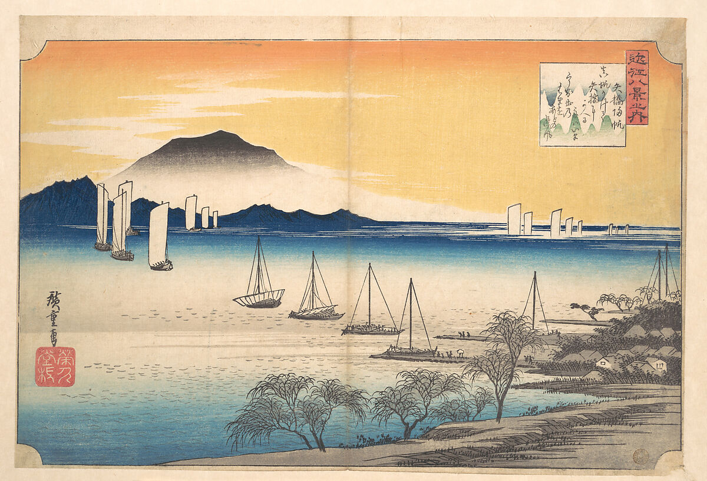

This page documents the Circadia Lab's visual identity — colours, logo, and typeset. It is intended as a reference for students, research assistants, and collaborators contributing to the website or producing lab materials.

## Colour palette

The lab's colour palette was inspired by Hiroshige's woodblock print *Sailing Boats Returning to Yabase, Lake Biwa*.


*Sailing Boats Returning to Yabase, Lake Biwa.
Utagawa Hiroshige (Japanese).
ca. 1835*

The picture is composed of yellow and blue tones, which are particularly relevant in the context of rhythmicity and chronobiology — blue and yellow light play central roles in circadian entrainment. We derived six tones on a divergent palette from Hiroshige's print.

| Role | Name | Hex |
|------|------|-----|
| Primary dark | Deep blue | `#014370` |
| Primary accent | Coral red | `#FC544A` |
| Secondary | Mid blue | `#1B6799` |
| Secondary accent | Amber | `#FFA75D` |
| Highlight | Sky teal | `#9BDFE2` |
| Background | Antique white | `#FFECD4` |

When creating figures, slides, or any lab materials, please draw from this palette rather than introducing new colours. The interactive widget below shows the full palette.

<br>

```{=html}
<!-- Coolors Palette Widget -->
      <script src="https://coolors.co/palette-widget/widget.js"></script>
      <script data-id="06047768881598022">new CoolorsPaletteWidget("06047768881598022", ["014370","fc544a","1b6799","ffa75d","9bdfe2","ffecd4"]); </script>
```

<br>

## Logo

The logo explores the dichotomy between day and night, light and darkness, yellow and blue light — linking these to circadian rhythms. It incorporates a wave-like symbol often used to illustrate *zeitgebers* (environmental synchronisers of the biological clock).

<br>


<br>

The logo files are stored in the website repository root (`logo.png` for small use, `logo_large.png` for display). Use the PNG files as provided — do not recolour or modify the logo.

## Typeset

The website uses two typefaces, both sourced from [Google Fonts](https://fonts.google.com) and loaded via `styles.scss`. They are applied globally and should not be overridden in individual pages.

| Typeface | Role | Usage |
|----------|------|-------|
| [Playfair Display](https://fonts.google.com/specimen/Playfair+Display) | Headings | `h1`, `h2`, `h3` — weight 700 |
| [Alice](https://fonts.google.com/specimen/Alice) | Body | All running text — base size 22 px |

**Playfair Display** is a transitional serif designed for display use, with high-contrast strokes and elegant proportions. Its classical character complements the lab's visual identity rooted in historical art.

**Alice** is a bookish serif optimised for long-form reading on screen. Its sturdy letterforms and generous x-height keep body copy comfortable at the site's 22 px base size.

If you are producing slide decks or posters for the lab, please use the same typefaces. Both are freely available on Google Fonts and can be downloaded for use in PowerPoint, Keynote, or other tools.

<br>

```{=html}
<div style="font-family: 'Playfair Display', serif; font-size: 2.4rem; font-weight: 700; color: #014370; line-height: 1.2; margin-bottom: 0.25rem;">
  Playfair Display
</div>
<div style="font-family: 'Playfair Display', serif; font-size: 1.1rem; color: #1b6799; letter-spacing: 0.02em; margin-bottom: 2rem;">
  ABCDEFGHIJKLMNOPQRSTUVWXYZ &nbsp; abcdefghijklmnopqrstuvwxyz &nbsp; 0123456789
</div>
<div style="font-family: 'Alice', serif; font-size: 1.8rem; color: #014370; line-height: 1.2; margin-bottom: 0.25rem;">
  Alice
</div>
<div style="font-family: 'Alice', serif; font-size: 1.1rem; color: #1b6799; letter-spacing: 0.02em;">
  ABCDEFGHIJKLMNOPQRSTUVWXYZ &nbsp; abcdefghijklmnopqrstuvwxyz &nbsp; 0123456789
</div>
```