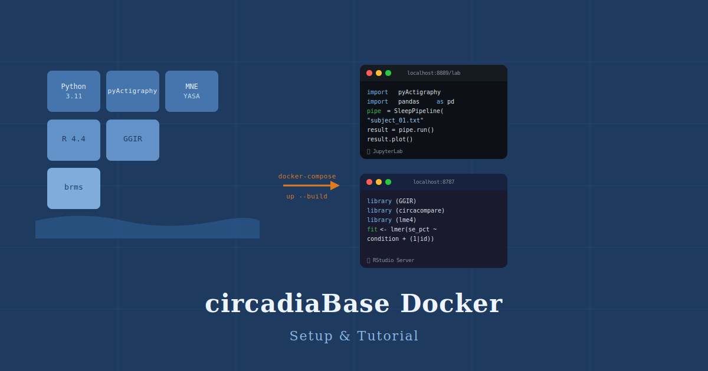
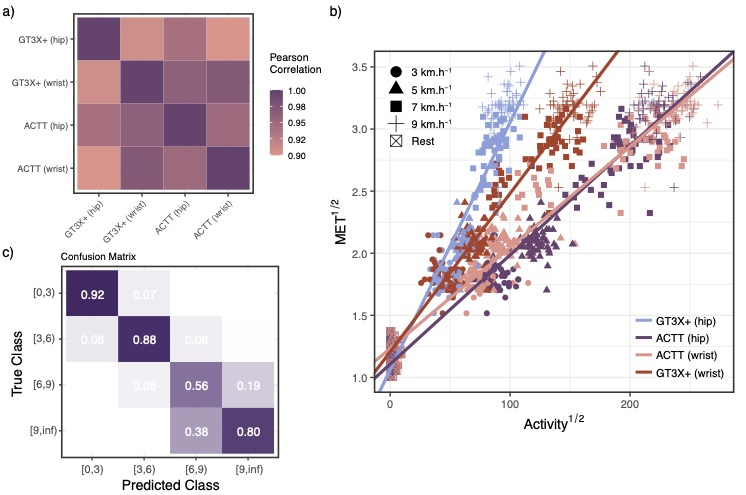

:::{#main}

## About us

We are an interdisciplinary group spanning the [School of Computer Science](https://www.northumbria.ac.uk/about-us/academic-departments/computer-and-information-sciences/) and the [School of Psychology](https://www.northumbria.ac.uk/about-us/academic-departments/psychology/) at [Northumbria University](https://www.northumbria.ac.uk). Our research focusses on the intersection of physics, computer science, physiology and chronobiology. We are particularly interested in sleep, rhythmicity, and medical signals of various modalities.

The word *"Circadia"* derives from the Latin *"circa diem"* meaning "around the day", a reference to the circadian rhythms that govern our lives and the focus of our research. It also rhymes with *"arcadia"* - a place for exploration, discovery and learning.

::: 

## Our tools & software

```{=html}
<div id="pc-wrap">
  <button class="pc-btn" id="pc-prev" aria-label="Previous">&#8249;</button>
  <div id="pc-viewport">
    <div id="pc-track"></div>
  </div>
  <button class="pc-btn" id="pc-next" aria-label="Next">&#8250;</button>
</div>
<div id="pc-dots"></div>

<script>
(function(){
  var products = [
    { href: "https://sleepdiaries.circadia-lab.uk", img: "sleepdiaries-icon.png",             name: "Sleep Diaries", desc: "Digital sleep diary for research and clinical use",             tag: "App" },
    { href: "https://scoreme.circadia-lab.uk",     img: "scoreme-icon.svg",                   name: "ScoreMe",      desc: "Scoring and interpretation of sleep questionnaires",         tag: "App" },
    { href: "https://slumbr.circadia-lab.uk",      img: "https://slumbr.circadia-lab.uk/logo.svg",   name: "slumbR",       desc: "R package for sleep data analysis and visualisation",        tag: "R pkg" },
    { href: "https://tallier.circadia-lab.uk",     img: "https://tallier.circadia-lab.uk/logo.svg",  name: "tallieR",      desc: "R package for ScoreMe questionnaire data",                  tag: "R pkg" },
    { href: "https://r-itable.circadia-lab.uk",    img: "https://r-itable.circadia-lab.uk/logo.svg", name: "R-itable",     desc: "Pedigree-based heritability estimation",                    tag: "R pkg" },
    { href: "https://github.com/circadia-bio/circadiaBase_Docker", img: null, emoji: "&#x1F433;", name: "Circadia Docker", desc: "Reproducible research environment for chronobiology", tag: "Infra" }
  ];

  var VISIBLE = window.innerWidth < 600 ? 1 : 5;
  var N = products.length;
  var track = document.getElementById('pc-track');
  var dotsEl = document.getElementById('pc-dots');
  var current = 0;

  function makeCard(p, isClone) {
    var a = document.createElement('a');
    a.className = 'pc-card';
    a.href = p.href;
    a.target = '_blank';
    a.rel = 'noopener';
    if (isClone) a.setAttribute('aria-hidden', 'true');
    if (p.img) {
      var img = document.createElement('img');
      img.src = p.img;
      img.alt = p.name;
      img.className = 'pc-icon';
      a.appendChild(img);
    } else {
      var em = document.createElement('span');
      em.className = 'pc-emoji';
      em.innerHTML = p.emoji;
      a.appendChild(em);
    }
    var name = document.createElement('p');
    name.className = 'pc-name';
    name.textContent = p.name;
    var desc = document.createElement('p');
    desc.className = 'pc-desc';
    desc.textContent = p.desc;
    var tag = document.createElement('span');
    tag.className = 'pc-tag';
    tag.textContent = p.tag + ' →';
    a.appendChild(name);
    a.appendChild(desc);
    a.appendChild(tag);
    return a;
  }

  products.forEach(function(p) { track.appendChild(makeCard(p, false)); });
  products.forEach(function(p) { track.appendChild(makeCard(p, true)); });

  for (var i = 0; i < N; i++) {
    (function(idx){
      var d = document.createElement('button');
      d.className = 'pc-dot';
      d.setAttribute('aria-label', 'Go to ' + products[idx].name);
      d.onclick = function() { goTo(idx, true); };
      dotsEl.appendChild(d);
    })(i);
  }

  function cardW() {
    var c = track.querySelector('.pc-card');
    return c ? c.getBoundingClientRect().width + 14 : 0;
  }

  function setPos(animated) {
    track.style.transition = animated ? 'transform 0.45s cubic-bezier(0.4,0,0.2,1)' : 'none';
    track.style.transform = 'translateX(-' + (current * cardW()) + 'px)';
    dotsEl.querySelectorAll('.pc-dot').forEach(function(d, i) {
      d.classList.toggle('pc-dot-on', i === current % N);
    });
  }

  function goTo(idx, animated) {
    current = idx;
    setPos(animated !== false);
  }

  function next() { goTo(current + 1, true); }
  function prev() { goTo(current - 1 + N, true); }

  track.addEventListener('transitionend', function() {
    if (current >= N) { current = current - N; setPos(false); }
    if (current < 0)  { current = current + N; setPos(false); }
  });

  document.getElementById('pc-next').onclick = next;
  document.getElementById('pc-prev').onclick = prev;

  var timer = setInterval(next, 3000);
  var wrap = document.getElementById('pc-wrap');
  wrap.addEventListener('mouseenter', function() { clearInterval(timer); });
  wrap.addEventListener('mouseleave', function() { timer = setInterval(next, 3000); });

  setPos(false);
})();
</script>
```

## News

```{=html}
<div id="news-carousel">
  <div id="nc-track">

    <div class="nc-slide">
      <a href="blog/circadiabase_docker/index.html" class="nc-image">
        
      </a>
      <div class="nc-body">
        <span class="nc-label">Tutorials</span>
        <a href="blog/circadiabase_docker/index.html" class="nc-title">Setting up circadiaBase Docker</a>
        <p class="nc-desc">A step-by-step guide to spinning up the Circadia Lab&#8217;s reproducible research environment&#8202;&mdash;&#8202;JupyterLab and RStudio Server in a single Docker Compose stack&#8202;&mdash;&#8202;for chronobiology and actigraphy research.</p>
        <a href="blog.html" class="news-see-all">See all</a>
      </div>
    </div>

    <div class="nc-slide nc-slide-flip">
      <a href="publications/batista2026/index.html" class="nc-image">
        
      </a>
      <div class="nc-body">
        <span class="nc-label">Publications</span>
        <a href="publications/batista2026/index.html" class="nc-title">From Movement to METs: A Validation of ActTrust&#174; for Energy Expenditure Estimation and Physical Activity Classification in Young Adults</a>
        <p class="nc-desc">Physical activity (PA) is recognised for providing several health benefits in humans, mainly preventing and controlling chronic non-communicable diseases. However estimating PA is a challenging and expensive task&#8230;</p>
        <a href="publications.html" class="news-see-all">See all</a>
      </div>
    </div>

  </div>

  <div id="nc-controls">
    <button class="nc-btn" id="nc-prev" aria-label="Previous">&#8249;</button>
    <div id="nc-dots"></div>
    <button class="nc-btn" id="nc-next" aria-label="Next">&#8250;</button>
  </div>
</div>

<script>
(function(){
  var track  = document.getElementById('nc-track');
  var slides = track.querySelectorAll('.nc-slide');
  var dotsEl = document.getElementById('nc-dots');
  var N = slides.length;
  var current = 0;
  var timer;

  // Build dots
  slides.forEach(function(_, i) {
    var d = document.createElement('button');
    d.className = 'nc-dot';
    d.setAttribute('aria-label', 'Slide ' + (i + 1));
    d.onclick = function() { goTo(i); };
    dotsEl.appendChild(d);
  });

  function goTo(idx) {
    slides[current].classList.remove('nc-active');
    dotsEl.children[current].classList.remove('nc-dot-on');
    current = (idx + N) % N;
    slides[current].classList.add('nc-active');
    dotsEl.children[current].classList.add('nc-dot-on');
  }

  function next() { goTo(current + 1); }
  function prev() { goTo(current - 1); }

  document.getElementById('nc-next').onclick = next;
  document.getElementById('nc-prev').onclick = prev;

  function startTimer() { timer = setInterval(next, 4000); }
  function stopTimer()  { clearInterval(timer); }

  document.getElementById('news-carousel').addEventListener('mouseenter', stopTimer);
  document.getElementById('news-carousel').addEventListener('mouseleave', startTimer);

  // Init
  goTo(0);
  startTimer();
})();
</script>
```
