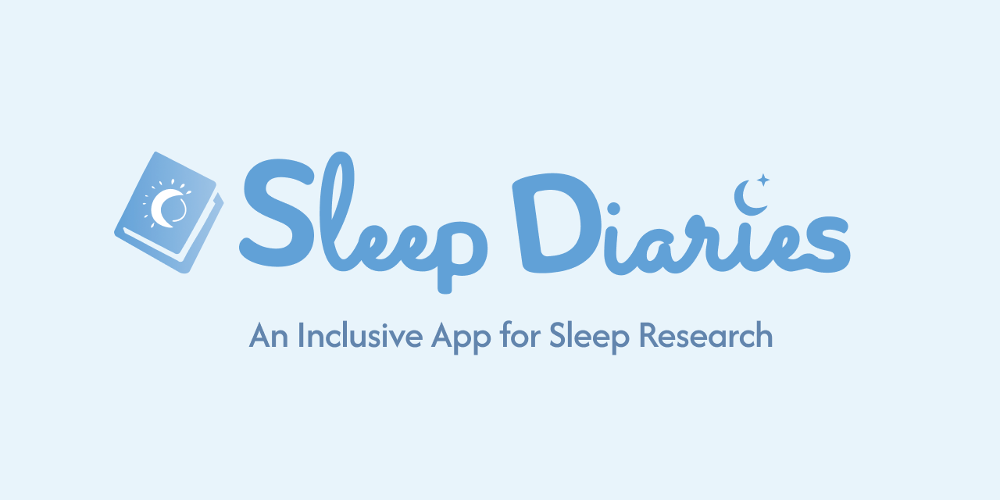
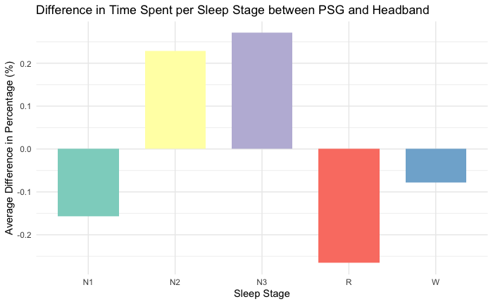
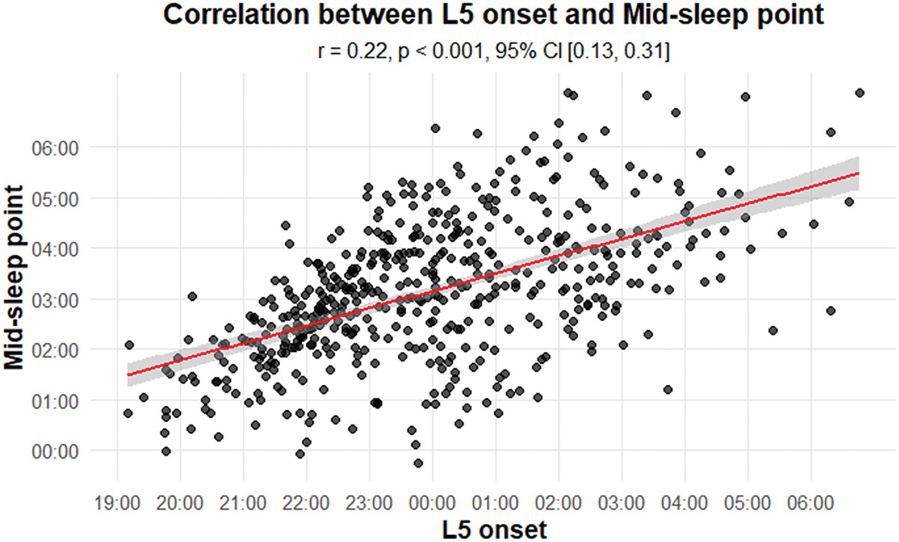
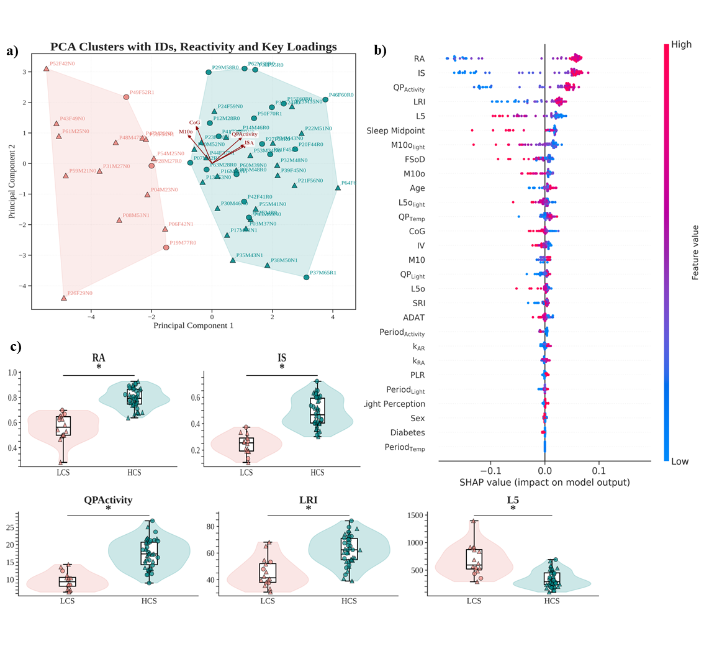
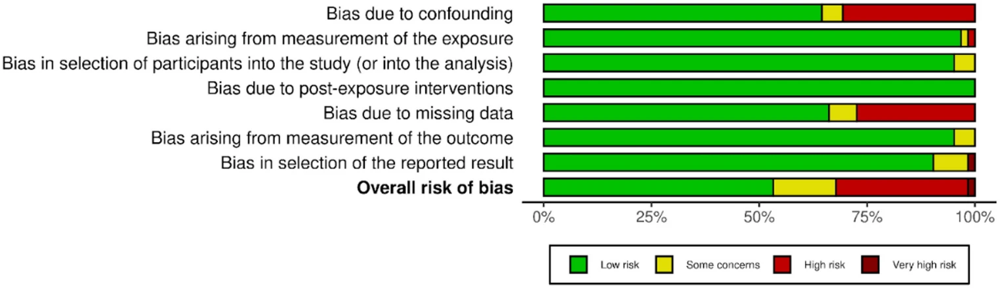
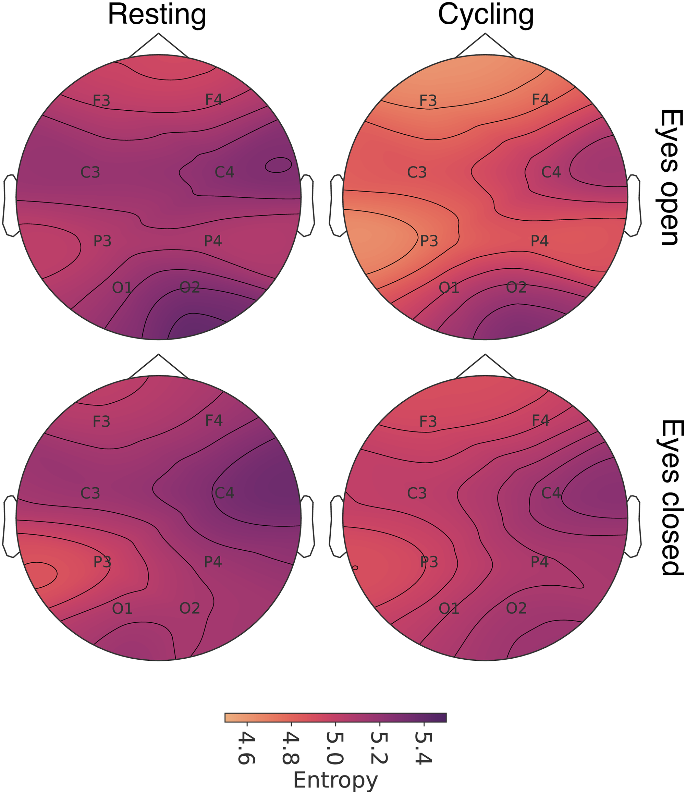
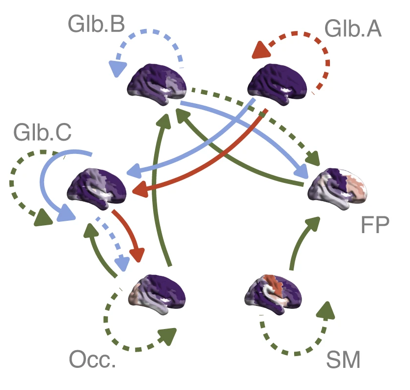
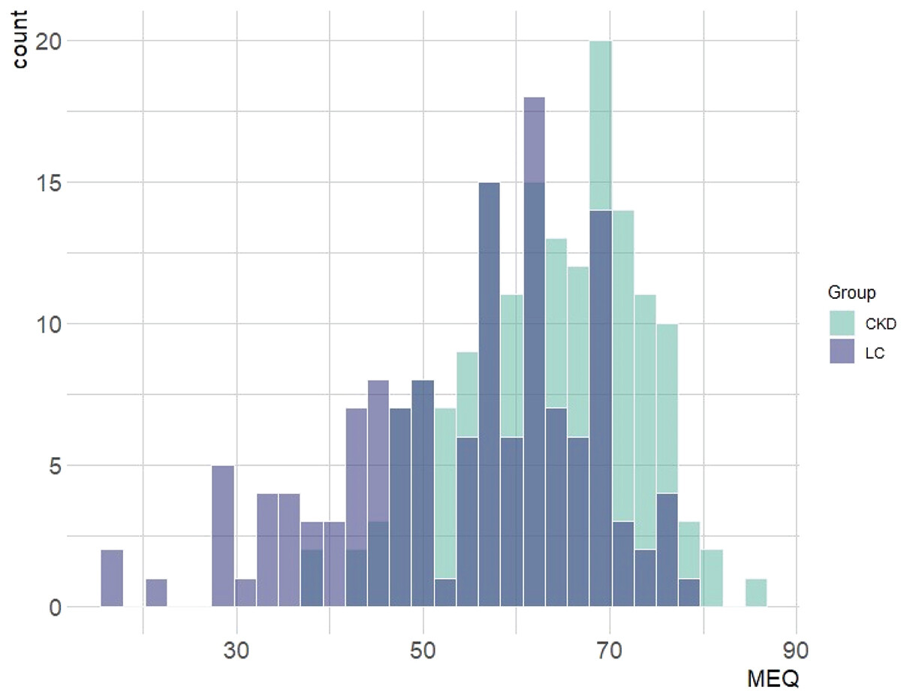
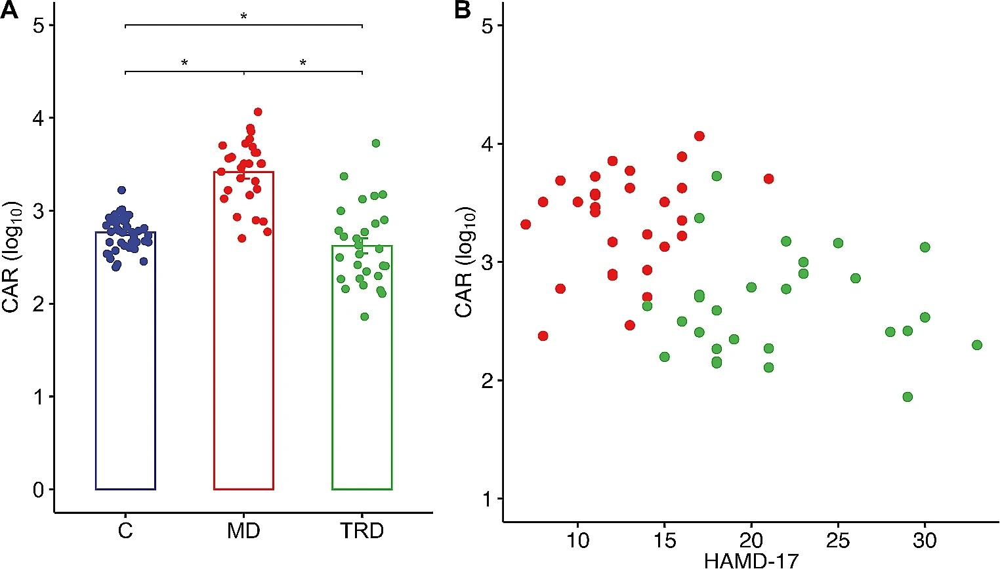
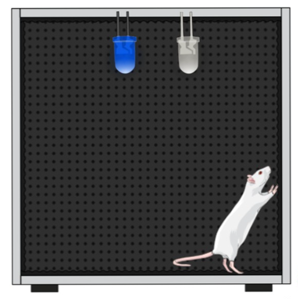

:::{#main}

## About us

We are an interdisciplinary group spanning the [School of Computer Science](https://www.northumbria.ac.uk/about-us/academic-departments/computer-and-information-sciences/) and the [School of Psychology](https://www.northumbria.ac.uk/about-us/academic-departments/psychology/) at [Northumbria University](https://www.northumbria.ac.uk). Our research focusses on the intersection of physics, computer science, physiology and chronobiology. We are particularly interested in sleep, rhythmicity, and medical signals of various modalities.

The word *"Circadia"* derives from the Latin *"circa diem"* meaning "around the day", a reference to the circadian rhythms that govern our lives and the focus of our research. It also rhymes with *"arcadia"* - a place for exploration, discovery and learning.

Interested in working with us? Visit our [Join us](/join.html) page.

::: 

## Our tools & software

```{=html}
<div id="pc-wrap">
  <div id="pc-viewport">
    <div id="pc-track"></div>
  </div>
</div>
<div id="pc-controls">
  <button class="pc-btn" id="pc-prev" aria-label="Previous">&#8249;</button>
  <div id="pc-dots"></div>
  <button class="pc-btn" id="pc-next" aria-label="Next">&#8250;</button>
</div>

<script>
(function(){
  var products = [
    { href: "https://sleepdiaries.circadia-lab.uk", img: "sleepdiaries-icon.png",             name: "Sleep Diaries", desc: "Digital sleep diary for research and clinical use",             tag: "App" },
    { href: "https://scoreme.circadia-lab.uk",     img: "scoreme-icon.svg",                   name: "ScoreMe",      desc: "Scoring and interpretation of sleep questionnaires",         tag: "App" },
    { href: "https://slumbr.circadia-lab.uk",      img: "https://slumbr.circadia-lab.uk/logo.svg",   name: "slumbR",       desc: "R package for sleep data analysis and visualisation",        tag: "R pkg" },
    { href: "https://zeitr.circadia-lab.uk",       img: "https://zeitr.circadia-lab.uk/logo.svg",    name: "zeitR",        desc: "R package for actigraphy parsing and sleep pipeline analysis", tag: "R pkg" },
    { href: "https://tallier.circadia-lab.uk",     img: "https://tallier.circadia-lab.uk/logo.svg",  name: "tallieR",      desc: "R package for ScoreMe questionnaire data",                  tag: "R pkg" },
    { href: "https://r-itable.circadia-lab.uk",    img: "https://r-itable.circadia-lab.uk/logo.svg", name: "R-itable",     desc: "Pedigree-based heritability estimation",                    tag: "R pkg" },
    { href: "https://github.com/circadia-bio/circadiaBase_Docker", img: null, emoji: "&#x1F433;", name: "Circadia Docker", desc: "Reproducible research environment for chronobiology", tag: "Infra" }
  ];

  var VISIBLE = window.innerWidth < 600 ? 1 : 5;
  var N = products.length;
  var track = document.getElementById('pc-track');
  var dotsEl = document.getElementById('pc-dots');
  var current = 0;

  function makeCard(p, isClone) {
    var a = document.createElement('a');
    a.className = 'pc-card';
    a.href = p.href;
    a.target = '_blank';
    a.rel = 'noopener';
    if (isClone) a.setAttribute('aria-hidden', 'true');
    if (p.img) {
      var img = document.createElement('img');
      img.src = p.img;
      img.alt = p.name;
      img.className = 'pc-icon';
      a.appendChild(img);
    } else {
      var em = document.createElement('span');
      em.className = 'pc-emoji';
      em.innerHTML = p.emoji;
      a.appendChild(em);
    }
    var name = document.createElement('p');
    name.className = 'pc-name';
    name.textContent = p.name;
    var desc = document.createElement('p');
    desc.className = 'pc-desc';
    desc.textContent = p.desc;
    var tag = document.createElement('span');
    tag.className = 'pc-tag';
    tag.textContent = p.tag + ' →';
    a.appendChild(name);
    a.appendChild(desc);
    a.appendChild(tag);
    return a;
  }

  products.forEach(function(p) { track.appendChild(makeCard(p, false)); });
  products.forEach(function(p) { track.appendChild(makeCard(p, true)); });

  for (var i = 0; i < N; i++) {
    (function(idx){
      var d = document.createElement('button');
      d.className = 'pc-dot';
      d.setAttribute('aria-label', 'Go to ' + products[idx].name);
      d.onclick = function() { goTo(idx, true); };
      dotsEl.appendChild(d);
    })(i);
  }

  function cardW() {
    var c = track.querySelector('.pc-card');
    return c ? c.getBoundingClientRect().width + 14 : 0;
  }

  function setPos(animated) {
    track.style.transition = animated ? 'transform 0.45s cubic-bezier(0.4,0,0.2,1)' : 'none';
    track.style.transform = 'translateX(-' + (current * cardW()) + 'px)';
    dotsEl.querySelectorAll('.pc-dot').forEach(function(d, i) {
      d.classList.toggle('pc-dot-on', i === current % N);
    });
  }

  function goTo(idx, animated) {
    current = idx;
    setPos(animated !== false);
  }

  function next() { goTo(current + 1, true); }
  function prev() { goTo(current - 1 + N, true); }

  track.addEventListener('transitionend', function() {
    if (current >= N) { current = current - N; setPos(false); }
    if (current < 0)  { current = current + N; setPos(false); }
  });

  document.getElementById('pc-next').onclick = next;
  document.getElementById('pc-prev').onclick = prev;

  var timer = setInterval(next, 3000);
  var wrap = document.getElementById('pc-wrap');
  wrap.addEventListener('mouseenter', function() { clearInterval(timer); });
  wrap.addEventListener('mouseleave', function() { timer = setInterval(next, 3000); });

  setPos(false);
})();
</script>
```

## News

<!-- NEWS:START -->
```{=html}
<div class="nc-wrap">

  <div class="nc-carousel" id="nc-tutorials">
    <div class="nc-track">

      <div class="nc-slide nc-active">
        <a href="blog/circadiabase_docker/index.html" class="nc-image"></a>
        <div class="nc-body">
          <div class="nc-label-row"><span class="nc-label">Tutorials</span><a href="blog.html" class="news-see-all">See all</a></div>
          <a href="blog/circadiabase_docker/index.html" class="nc-title">Setting up circadiaBase Docker</a>
          <p class="nc-desc">A step-by-step guide to spinning up the Circadia Lab's reproducible research environment — JupyterLab and RStudio Server in a single Docker Compose stack — for chronobiology and actigraphy research.</p>
        </div>
      </div>

      <div class="nc-slide nc-slide-flip">
        <a href="blog/sleep_diaries_app/index.html" class="nc-image"></a>
        <div class="nc-body">
          <div class="nc-label-row"><span class="nc-label">Tutorials</span><a href="blog.html" class="news-see-all">See all</a></div>
          <a href="blog/sleep_diaries_app/index.html" class="nc-title">Introducing Sleep Diaries: an open-source sleep diary app for research</a>
          <p class="nc-desc">We are releasing Sleep Diaries — a free, open-source, research-grade sleep diary app built with React Native and Expo. It runs on iOS, Android, and the web, and is designed to be easily adapted for clinical sleep research and personal use.</p>
        </div>
      </div>

      <div class="nc-slide">
        <a href="blog/sleep_PSG/index.html" class="nc-image"></a>
        <div class="nc-body">
          <div class="nc-label-row"><span class="nc-label">Tutorials</span><a href="blog.html" class="news-see-all">See all</a></div>
          <a href="blog/sleep_PSG/index.html" class="nc-title">Sleep PSG validation</a>
          <p class="nc-desc">This post presents an analysis of sleep stage</p>
        </div>
      </div>

    </div>
    <div class="nc-controls">
      <button class="nc-btn nc-prev" aria-label="Previous">&#8249;</button>
      <div class="nc-dots"></div>
      <button class="nc-btn nc-next" aria-label="Next">&#8250;</button>
    </div>
  </div>

  <div class="nc-carousel" id="nc-publications">
    <div class="nc-track">

      <div class="nc-slide nc-active">
        <a href="publications/buest2026/index.html" class="nc-image"></a>
        <div class="nc-body">
          <div class="nc-label-row"><span class="nc-label">Publications</span><a href="publications.html" class="news-see-all">See all</a></div>
          <a href="publications/buest2026/index.html" class="nc-title">L5 onset as a proxy for circadian phase in infants</a>
          <p class="nc-journal"><em>Chronobiology International</em> &middot; 2026</p>
          <p class="nc-desc">This study examined whether L5 onset — the start of the least active 5-hour period derived from rest–activity rhythms — can serve as a proxy for circadian phase in six-month-old infants, where standard sleep-scoring algorithms validated for adults have limited applicability. Analysing 502 nights from 81 infants, a significant positive correlation was found between mid-sleep point and L5 onset, supporting L5 onset as a practical, non-invasive circadian phase marker in early childhood.</p>
        </div>
      </div>

      <div class="nc-slide nc-slide-flip">
        <a href="publications/batista2026/index.html" class="nc-image"></a>
        <div class="nc-body">
          <div class="nc-label-row"><span class="nc-label">Publications</span><a href="publications.html" class="news-see-all">See all</a></div>
          <a href="publications/batista2026/index.html" class="nc-title">From Movement to METs: A Validation of ActTrust® for Energy Expenditure Estimation and Physical Activity Classification in Young Adults</a>
          <p class="nc-journal"><em>PLOS ONE</em> &middot; 2026</p>
          <p class="nc-desc">Validation of the ActTrust® actigraphy device against the ActiGraph® GT3X+ and indirect calorimetry in 56 young adults. Derives the first published cut-points for physical activity intensity classification using ActTrust® at hip and wrist placements.</p>
        </div>
      </div>

      <div class="nc-slide">
        <a href="publications/pugliane2026/index.html" class="nc-image"></a>
        <div class="nc-body">
          <div class="nc-label-row"><span class="nc-label">Publications</span><a href="publications.html" class="news-see-all">See all</a></div>
          <a href="publications/pugliane2026/index.html" class="nc-title">Low-latitude environmental regularity sustains non-photic entrainment in blind adults</a>
          <p class="nc-journal"><em>bioRxiv (preprint)</em> &middot; 2026</p>
          <p class="nc-desc">Using wrist actigraphy and machine learning in 58 blind adults living near the equator in Brazil, this study shows that circadian rest–activity rhythms can remain stably entrained even without photic input. Two distinct circadian phenotypes were identified: 72% of participants showed Higher Circadian Stability, a proportion far exceeding previous reports in blind cohorts, suggesting that environmental regularity at low latitudes supports non-photic circadian entrainment.</p>
        </div>
      </div>

      <div class="nc-slide nc-slide-flip">
        <a href="publications/silva2025/index.html" class="nc-image"></a>
        <div class="nc-body">
          <div class="nc-label-row"><span class="nc-label">Publications</span><a href="publications.html" class="news-see-all">See all</a></div>
          <a href="publications/silva2025/index.html" class="nc-title">Chronotype Profile in Children: A Systematic Review</a>
          <p class="nc-journal"><em>Sleep and Vigilance</em> &middot; 2025</p>
          <p class="nc-desc">The first systematic review of chronotype profiling in children aged 0–10 years, conducted following PRISMA guidelines across five databases. The review finds inconsistent evidence on whether morning chronotype predominates in children, highlights the heterogeneity of measurement approaches used across studies, and identifies key gaps in the literature on circadian preference in early childhood.</p>
        </div>
      </div>

      <div class="nc-slide">
        <a href="publications/miguel2024/index.html" class="nc-image"></a>
        <div class="nc-body">
          <div class="nc-label-row"><span class="nc-label">Publications</span><a href="publications.html" class="news-see-all">See all</a></div>
          <a href="publications/miguel2024/index.html" class="nc-title">Heritability of sleep architecture based on home polysomnography</a>
          <p class="nc-journal"><em>Journal of Sleep Research</em> &middot; 2024</p>
          <p class="nc-desc">This study assessed the heritability of polysomnography sleep measures in 648 participants from the Baependi Heart Study in Brazil. It found that genetic factors influence total sleep time, non-REM sleep stages (especially N3), and the apnea-hypopnea index, but not REM sleep. These findings support the feasibility of future genetic studies on sleep traits.</p>
        </div>
      </div>

      <div class="nc-slide nc-slide-flip">
        <a href="publications/palombini2024/index.html" class="nc-image"></a>
        <div class="nc-body">
          <div class="nc-label-row"><span class="nc-label">Publications</span><a href="publications.html" class="news-see-all">See all</a></div>
          <a href="publications/palombini2024/index.html" class="nc-title">2024 Standardization of Polysomnography Reports — A Consensus of the Brazilian Sleep Association</a>
          <p class="nc-journal"><em>Sleep Science</em> &middot; 2024</p>
          <p class="nc-desc">A consensus document from the Brazilian Sleep Association establishing standardised reporting guidelines for polysomnography, covering scoring rules, technical specifications, and reporting conventions to improve consistency and comparability of sleep studies across Brazilian clinical and research settings.</p>
        </div>
      </div>

      <div class="nc-slide">
        <a href="publications/ferre2024/index.html" class="nc-image"></a>
        <div class="nc-body">
          <div class="nc-label-row"><span class="nc-label">Publications</span><a href="publications.html" class="news-see-all">See all</a></div>
          <a href="publications/ferre2024/index.html" class="nc-title">Cycling reduces the entropy of neuronal activity in the human adult cortex</a>
          <p class="nc-journal"><em>Plos One</em> &middot; 2024</p>
          <p class="nc-desc">This study used recurrence entropy to assess brain complexity (BC) in EEG signals during rest and cycling in 24 healthy adults. Results showed lower entropy during cycling, suggesting that repetitive movement reduces brain complexity due to continuous sensory feedback and streamlined sensorimotor processing.</p>
        </div>
      </div>

      <div class="nc-slide nc-slide-flip">
        <a href="publications/franca2024/index.html" class="nc-image"></a>
        <div class="nc-body">
          <div class="nc-label-row"><span class="nc-label">Publications</span><a href="publications.html" class="news-see-all">See all</a></div>
          <a href="publications/franca2024/index.html" class="nc-title">Neonatal brain dynamic functional connectivity in term and preterm infants and its association with early childhood neurodevelopment</a>
          <p class="nc-journal"><em>Nature Communications</em> &middot; 2024</p>
          <p class="nc-desc">This study examines dynamic functional connectivity in newborns using fMRI, revealing six transient brain connectivity states present at birth. It finds that preterm infants exhibit atypical connectivity patterns, which are linked to social, sensory, and repetitive behaviors at 18 months, suggesting early neurodevelopmental differences.</p>
        </div>
      </div>

      <div class="nc-slide">
        <a href="publications/nunes2024/index.html" class="nc-image"></a>
        <div class="nc-body">
          <div class="nc-label-row"><span class="nc-label">Publications</span><a href="publications.html" class="news-see-all">See all</a></div>
          <a href="publications/nunes2024/index.html" class="nc-title">Hemodialysis-induced chronodisruption and chronotype distribution in patients with chronic kidney disease</a>
          <p class="nc-journal"><em>The Journal of Biological and Medical Rhythm Research</em> &middot; 2024</p>
          <p class="nc-desc">This study examined circadian rhythm disruptions in 165 hemodialysis patients, finding that 40.6% experienced hemodialysis-induced chronodisruption (HIC). A morning chronotype was more prevalent in CKD patients than in the general population. HIC and chronotype were linked to quality of life but not sleep quality, highlighting potential implications for patient well-being.</p>
        </div>
      </div>

      <div class="nc-slide nc-slide-flip">
        <a href="publications/torres2024/index.html" class="nc-image"></a>
        <div class="nc-body">
          <div class="nc-label-row"><span class="nc-label">Publications</span><a href="publications.html" class="news-see-all">See all</a></div>
          <a href="publications/torres2024/index.html" class="nc-title">Use of sleep quality questionary and cortisol awakening response as complementary tools for the evaluation of major depression progression</a>
          <p class="nc-journal"><em>Current Psychology</em> &middot; 2024</p>
          <p class="nc-desc">This study examined the relationship between sleep quality and cortisol awakening response (CAR) across major depression severity. Patients with treatment-resistant depression had poorer sleep and a blunted CAR, while those with mild depression showed worse sleep but an elevated CAR compared to healthy controls. Sleep quality, particularly sleep medication use and sleep efficiency, was a strong predictor of depression severity, highlighting its clinical relevance for assessing and managing major depressive disorder.</p>
        </div>
      </div>

      <div class="nc-slide">
        <a href="publications/silva2023/index.html" class="nc-image"></a>
        <div class="nc-body">
          <div class="nc-label-row"><span class="nc-label">Publications</span><a href="publications.html" class="news-see-all">See all</a></div>
          <a href="publications/silva2023/index.html" class="nc-title">Blue light exposure-dependent improvement in robustness of circadian rest-activity rhythm in aged rats</a>
          <p class="nc-journal"><em>Plos One</em> &middot; 2023</p>
          <p class="nc-desc">This study investigated the effects of blue light therapy on circadian rhythms in aging rats. Exposure to blue light for 14 days improved locomotor rhythmicity, increasing amplitude, robustness, and phase advance while enhancing rest-phase consolidation. However, these benefits required continuous exposure. The findings suggest that blue light may help mitigate age-related circadian dysfunctions, though further research is needed to understand the underlying neural mechanisms.</p>
        </div>
      </div>

    </div>
    <div class="nc-controls">
      <button class="nc-btn nc-prev" aria-label="Previous">&#8249;</button>
      <div class="nc-dots"></div>
      <button class="nc-btn nc-next" aria-label="Next">&#8250;</button>
    </div>
  </div>

</div>

<script>
(function(){
  document.querySelectorAll('.nc-carousel').forEach(function(carousel) {
    var slides = carousel.querySelectorAll('.nc-slide');
    var dotsEl = carousel.querySelector('.nc-dots');
    var N = slides.length;
    var current = 0;
    var timer;
    slides.forEach(function(_, i) {
      var d = document.createElement('button');
      d.className = 'nc-dot';
      d.setAttribute('aria-label', 'Slide ' + (i + 1));
      d.onclick = function() { goTo(i); };
      dotsEl.appendChild(d);
    });
    function goTo(idx) {
      slides[current].classList.remove('nc-active');
      dotsEl.children[current].classList.remove('nc-dot-on');
      current = (idx + N) % N;
      slides[current].classList.add('nc-active');
      dotsEl.children[current].classList.add('nc-dot-on');
    }
    carousel.querySelector('.nc-prev').onclick = function() { goTo(current - 1); };
    carousel.querySelector('.nc-next').onclick = function() { goTo(current + 1); };
    function startTimer() { timer = setInterval(function(){ goTo(current + 1); }, 4500); }
    function stopTimer()  { clearInterval(timer); }
    carousel.addEventListener('mouseenter', stopTimer);
    carousel.addEventListener('mouseleave', startTimer);
    goTo(0);
    startTimer();
  });
})();
</script>
```
<!-- NEWS:END -->

