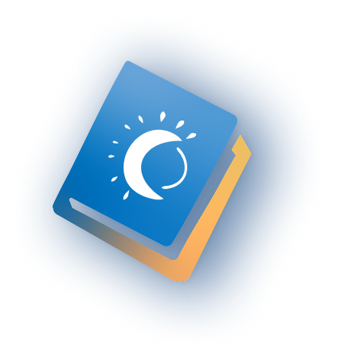

:::{#main}

## About us

We are an interdisciplinary group spanning the [School of Computer Science](https://www.northumbria.ac.uk/about-us/academic-departments/computer-and-information-sciences/) and the [School of Psychology](https://www.northumbria.ac.uk/about-us/academic-departments/psychology/) at [Northumbria University](https://www.northumbria.ac.uk). Our research focusses on the intersection of physics, computer science, physiology and chronobiology. We are particularly interested in sleep, rhythmicity, and medical signals of various modalities.

The word *"Circadia"* derives from the Latin *"circa diem"* meaning "around the day", a reference to the circadian rhythms that govern our lives and the focus of our research. It also rhymes with *"arcadia"* - a place for exploration, discovery and learning.

::: 

## Our tools & software

```{=html}
<div id="products-grid">

  <a class="product-card" href="https://sleepdiaries.circadia-lab.uk" target="_blank" rel="noopener">
    
    <p class="card-title">Sleep Diaries</p>
    <p class="card-desc">Structured digital sleep diary for research and clinical use</p>
    <span class="card-link tag-app">App →</span>
  </a>

  <a class="product-card" href="https://scoreme.circadia-lab.uk" target="_blank" rel="noopener">
    
    <p class="card-title">ScoreMe</p>
    <p class="card-desc">Scoring and interpretation of validated sleep questionnaires</p>
    <span class="card-link tag-app">App →</span>
  </a>

  <a class="product-card" href="https://slumbr.circadia-lab.uk" target="_blank" rel="noopener">
    
    <p class="card-title">slumbR</p>
    <p class="card-desc">R package for sleep data analysis and visualisation</p>
    <span class="card-link tag-pkg">R pkg →</span>
  </a>

  <a class="product-card" href="https://tallier.circadia-lab.uk" target="_blank" rel="noopener">
    
    <p class="card-title">tallieR</p>
    <p class="card-desc">R package for importing, scoring, and analysing ScoreMe questionnaire data</p>
    <span class="card-link tag-pkg">R pkg →</span>
  </a>

  <a class="product-card" href="https://github.com/circadia-bio/circadiaBase_Docker" target="_blank" rel="noopener">
    <span class="card-icon">🐳</span>
    <p class="card-title">Circadia Docker</p>
    <p class="card-desc">Reproducible research environment for chronobiology</p>
    <span class="card-link tag-infra">Infra →</span>
  </a>

</div>
```

---

## News

:::: {.grid}


::: {.g-col-6}
### Tutorials
::: {#blog}
:::
[See all &rarr;](blog.html){.about-links .subtitle}
:::

::: {.g-col-6}
### Publications
::: {#publication}
:::
[See all &rarr;](publications.html){.about-links .subtitle}
:::

::::
