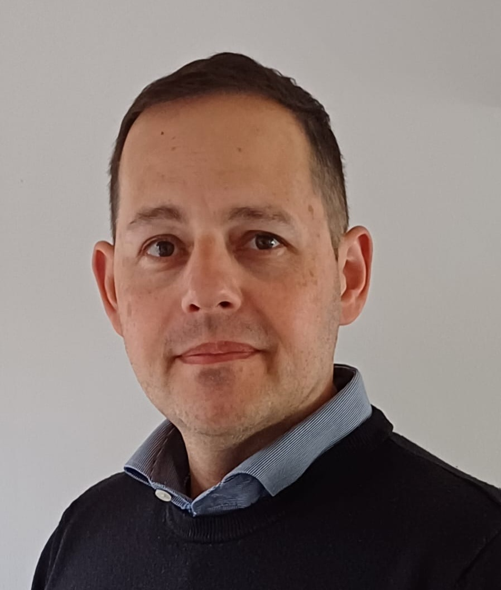
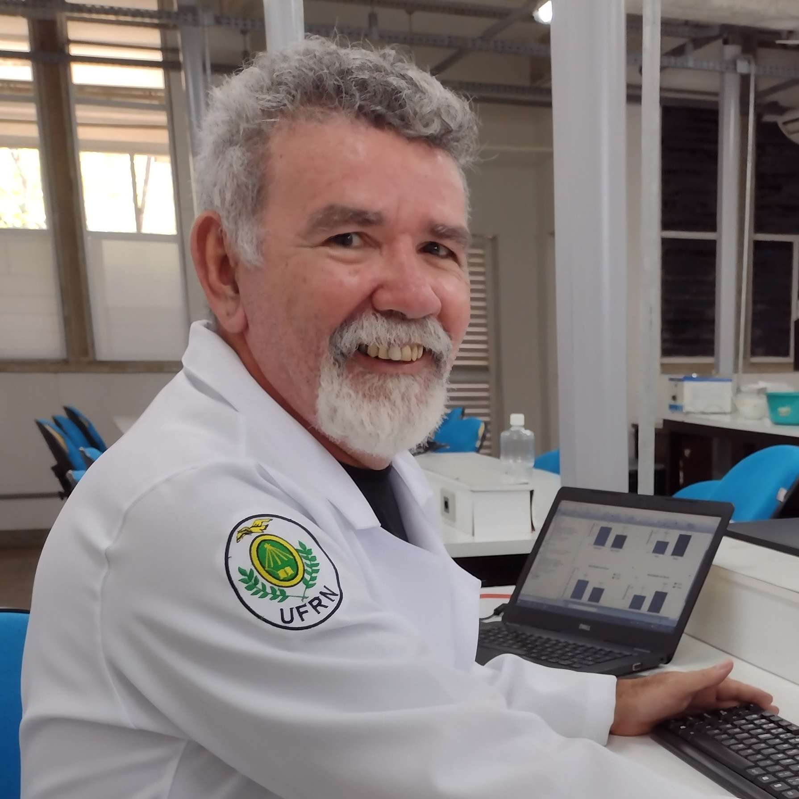
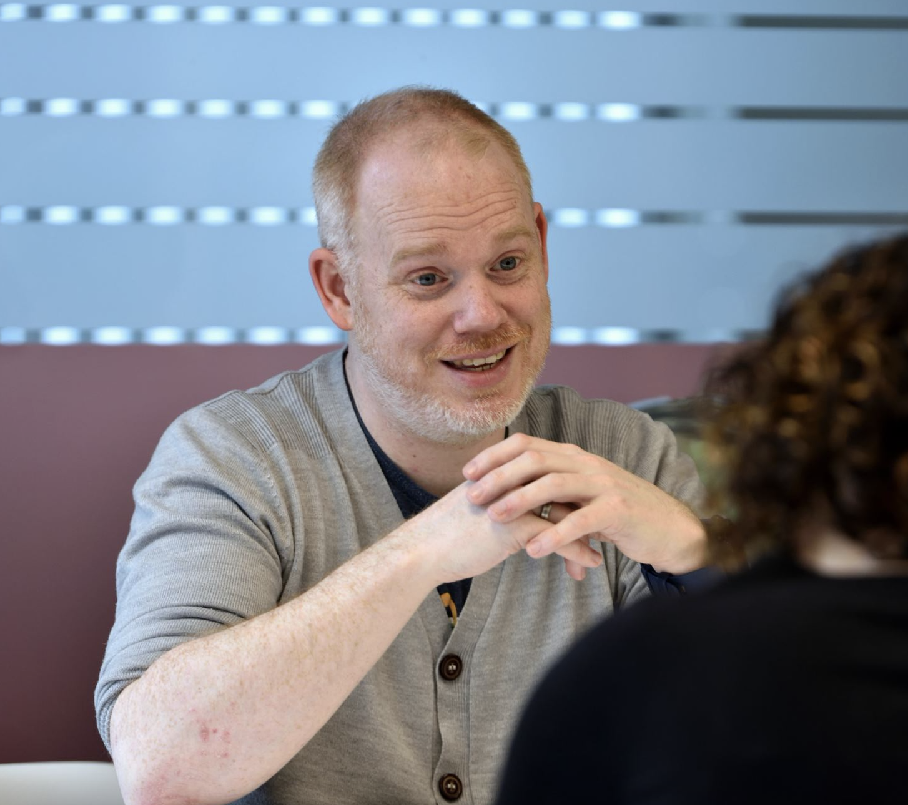
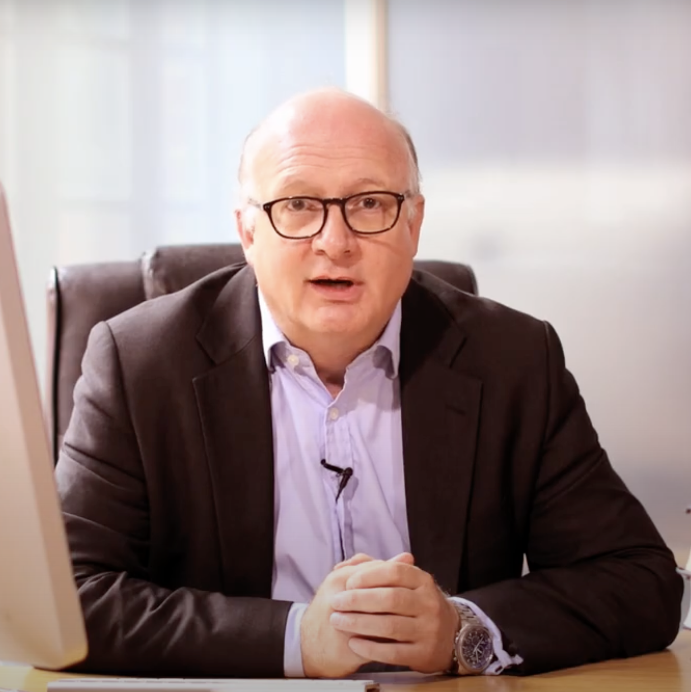

## Research Staff

```{=html}
<div id="rs-wrap">
  <div id="rs-track">

    <div class="rs-slide rs-active">
      <a class="rs-img-col" href="people/staff/lucas_franca.html">
        
      </a>
      <div class="rs-body">
        <p class="rs-role">Co-Lead</p>
        <h3 class="rs-name">Dr Lucas França</h3>
        <p class="rs-bio">A physicist by choice, a neuroscientist by fate, and a computer scientist by accident. Assistant Professor in Computer and Information Sciences at Northumbria University, with research spanning complex systems, computational neuroscience, and machine learning applied to sleep and circadian science.</p>
        <a href="people/staff/lucas_franca.html" class="rs-link">View profile →</a>
      </div>
    </div>

    <div class="rs-slide">
      <a class="rs-img-col" href="people/staff/mario_miguel.html">
        
      </a>
      <div class="rs-body">
        <p class="rs-role">Co-Lead</p>
        <h3 class="rs-name">Dr Mario Miguel</h3>
        <p class="rs-bio">A physiologist shaped by years of intensive chronobiology. Assistant Professor in Sleep Science at Northumbria University, with interests spanning sleep neurophysiology, circadian rhythms, mental health, and machine learning for physiological and behavioural signal processing.</p>
        <a href="people/staff/mario_miguel.html" class="rs-link">View profile →</a>
      </div>
    </div>

    <div class="rs-slide">
      <a class="rs-img-col" href="people/staff/nayantara_santhi.html">
        
      </a>
      <div class="rs-body">
        <p class="rs-role">Researcher</p>
        <h3 class="rs-name">Dr Nayantara Santhi</h3>
        <p class="rs-bio">Associate Professor in the School of Psychology at Northumbria University. Research spans non-visual effects of light, circadian timing and temperature as zeitgebers, insomnia interventions, and sleep in microgravity. Previously at Surrey Sleep Research Centre and Harvard Medical School.</p>
        <a href="people/staff/nayantara_santhi.html" class="rs-link">View profile →</a>
      </div>
    </div>

    <div class="rs-slide">
      <a class="rs-img-col" href="people/staff/julia_vallim.html">
        
      </a>
      <div class="rs-body">
        <p class="rs-role">Visiting Research Fellow</p>
        <h3 class="rs-name">Dr Julia Vallim</h3>
        <p class="rs-bio">Postdoctoral research fellow at the Federal University of São Paulo, focusing on how circadian rhythms influence health and disease. Specialises in actigraphy data analysis for predicting health outcomes and has experience with wearable sleep technology.</p>
        <a href="people/staff/julia_vallim.html" class="rs-link">View profile →</a>
      </div>
    </div>

  </div>
  <div id="rs-controls">
    <button class="rs-btn" id="rs-prev" aria-label="Previous">&#8249;</button>
    <div id="rs-dots"></div>
    <button class="rs-btn" id="rs-next" aria-label="Next">&#8250;</button>
  </div>
</div>

<script>
(function(){
  var slides = document.querySelectorAll('#rs-track .rs-slide');
  var dotsEl = document.getElementById('rs-dots');
  var N = slides.length;
  var cur = 0;
  var timer;

  slides.forEach(function(_, i){
    var d = document.createElement('button');
    d.className = 'rs-dot' + (i === 0 ? ' rs-dot-on' : '');
    d.setAttribute('aria-label', 'Slide ' + (i + 1));
    d.onclick = function(){ goTo(i); };
    dotsEl.appendChild(d);
  });

  function goTo(i){
    slides[cur].classList.remove('rs-active');
    dotsEl.children[cur].classList.remove('rs-dot-on');
    cur = (i + N) % N;
    slides[cur].classList.add('rs-active');
    dotsEl.children[cur].classList.add('rs-dot-on');
  }

  function startTimer(){ timer = setInterval(function(){ goTo(cur + 1); }, 4000); }
  function stopTimer(){ clearInterval(timer); }

  document.getElementById('rs-prev').onclick = function(){ stopTimer(); goTo(cur - 1); startTimer(); };
  document.getElementById('rs-next').onclick = function(){ stopTimer(); goTo(cur + 1); startTimer(); };

  var wrap = document.getElementById('rs-wrap');
  wrap.addEventListener('mouseenter', stopTimer);
  wrap.addEventListener('mouseleave', startTimer);

  startTimer();
})();
</script>
```

## Students

:::{#students}
:::

## Collaborators

```{=html}
<div id="co-wrap">
  <button class="co-btn" id="co-prev" aria-label="Previous">&#8249;</button>
  <div id="co-viewport">
    <div id="co-track">

      <a class="co-card" href="people/collaborators/john_araujo.html">
        
        <p class="co-name">Prof. John Araújo</p>
        <p class="co-inst">Federal University of Rio Grande do Norte</p>
      </a>

      <a class="co-card" href="people/collaborators/nick_puts.html">
        
        <p class="co-name">Dr Nick Puts</p>
        <p class="co-inst">King's College London</p>
      </a>

      <a class="co-card" href="people/collaborators/matthew_walker.html">
        
        <p class="co-name">Prof. Matthew Walker</p>
        <p class="co-inst">University College London</p>
      </a>

      <a class="co-card" href="people/collaborators/yujiang_wang.html">
        
        <p class="co-name">Prof. Yujiang Wang</p>
        <p class="co-inst">Newcastle University</p>
      </a>

    </div>
  </div>
  <button class="co-btn" id="co-next" aria-label="Next">&#8250;</button>
</div>

<script>
(function(){
  var track = document.getElementById('co-track');
  var cards = track.querySelectorAll('.co-card');
  var VISIBLE = window.innerWidth < 600 ? 1 : 3;
  var N = cards.length;
  var idx = 0;

  function cardW(){ return cards[0] ? cards[0].getBoundingClientRect().width + 14 : 0; }
  function update(animated){
    track.style.transition = animated ? 'transform 0.4s cubic-bezier(0.4,0,0.2,1)' : 'none';
    track.style.transform = 'translateX(-' + (idx * cardW()) + 'px)';
  }

  document.getElementById('co-prev').onclick = function(){ if(idx > 0){ idx--; update(true); } };
  document.getElementById('co-next').onclick = function(){ if(idx < N - VISIBLE){ idx++; update(true); } };

  update(false);
})();
</script>
```

## Former Members

:::{#former}
:::
